# Introduction
Black box testing is a method for evaluating software functionality without examining internal workings. This is done by interacting with the external interface of an application through inputs and outputs, without considering the internal details. The goal of black box testing is to ensure that the application meets requirements and behaves as expected.

TESTONA is a tool used for systematic black box testing design. It supports several standard test methods like equivalence class, boundary value, partition, combinatorial, classification tree and statistical tests. The tool makes test specification generation simple and efficient and can be used across industries. It covers all test phases and is recommended by international standards and leading test trainers. It also provides metrics and evaluations to evaluate test scope and identify missing or redundant tests.

# Testona in action
The function that will be tested using the Testona tool and for which black box tests will be generated is the following:

    void Placeholder::setupPlaceholderRules(char player, ReversiBoard *reversiboard){
        LOG(INFO) << "**************************** Begin Calculating placeholder places ******************************************************";

        LOG(INFO) << "Begin Calculating placeholder places";
        if (reversiboard == NULL)
        {
            LOG(ERROR) << "reversiboard is undefined";
            exit(1);
        }

        if (player != 'B' && player !='W') {
            LOG(ERROR) << "player is undefined";
            exit(1);
        }

        resetPlaceholderPlaces(reversiboard);
        for(int i = 0; i < 8; i++) {
            for(int j = 0; j < 8; j++)
            {
                if ('B' == reversiboard->getBoardCell(i,j) && 'B' == player) {
                    calculatePlaceholderPlacesForPlayer(i, j, 'B', reversiboard);
                } else if ('W' == reversiboard->getBoardCell(i,j) && 'W' == player) {
                    calculatePlaceholderPlacesForPlayer(i, j, 'W', reversiboard);
                }
            }
        }
        LOG(INFO) << "Finished calculating placeholder places";
    }

## Steps
### **Step 1 : Select a test object for the decomposition**
The test object selected for decomposition is `Setup Placeholder Rules`. This will be created as a root element with rounded edges and a thick border, and it will be decomposed into a series of compositions and classifications.

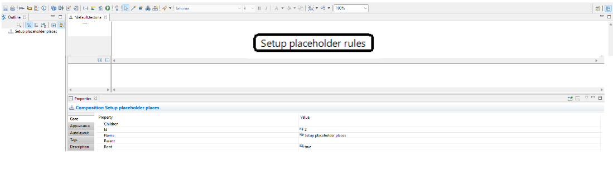

The goal of this step is to break down the function into smaller and more manageable parts, which can then be individually tested to ensure that the system or application behaves as expected. By selecting the appropriate test object and decomposing it, we can ensure comprehensive and efficient testing of the system or application.

### **Step 2 : Determine data inputs**
To determine the data inputs, we start by identifying the inputs required by the method. In this case, the inputs are "player" and "reversiboard".

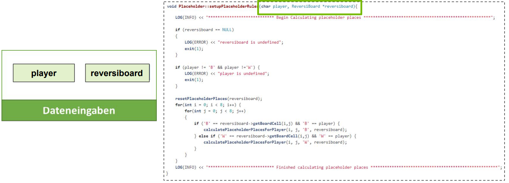

Next, we classify these inputs into different categories to ensure that we have considered all possible input scenarios.

For `playerPiece`, there are three states to consider: `B` or `W` for valid inputs/stones and `Other` for invalid inputs.

For "ReversiBoard", we also considered three inputs: `valid` (where a placeholder can be placed), `empty`, or `invalid`.

It's important to note that the classifications we made for the inputs are crucial in ensuring that the system or application we're testing will be able to handle all possible input scenarios. This helps in identifying any potential bugs and fixing them before they cause issues in production.

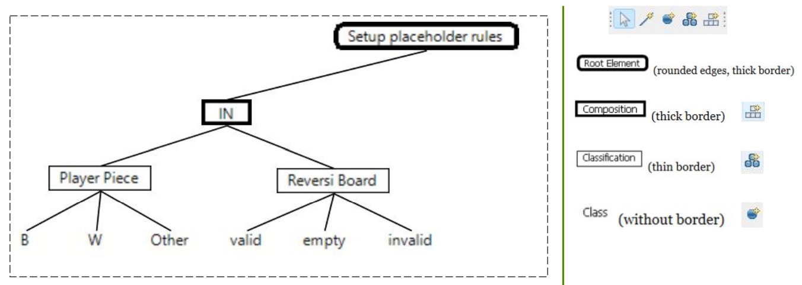

### **Step 3 : Identify the expected results**
To identify the expected results, it is important to understand what the desired outcome should be for each input. This will allow us to determine the expected results for the test cases that will be generated. In our case, we defined 2 classifications `Execution status` that comprises of `Error` and `Successfull` states and `Placeholder`, which comprises of `Set` and `Not set` states.

In the case of `Execution status`, it refers to the outcome of the function execution. The function should either terminate successfully with an output of `Successful` or with an output `Error`. 

On the other hand, the `Placeholder` output refers to the state of the calculated placeholder places in the reversiboard. If the placeholder places have been successfully set, the output will be Set. If not, the output will be Not set. The expected output of the Placeholder depends on the state of the input `reversiboard` and `player`.

With these two classifications, we can now determine the expected results of our testing, which will be based on the inputs provided to the function `setupPlaceholderRules`.

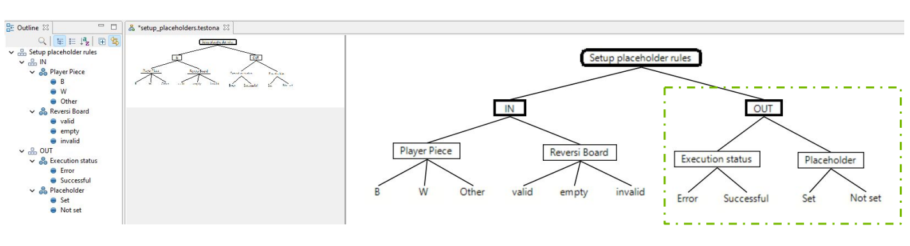

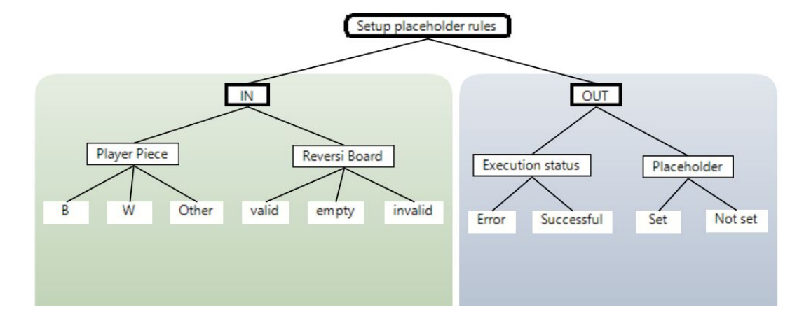

### **Step 4 : Define rules**
To expand on step 4, the process of defining rules involves mapping the relationships between inputs and outputs and using this information to create specific test cases. In our case, we have defined two rules to capture the relationships between the data inputs and expected outputs. These rules are crucial as they help in identifying the necessary test cases that need to be generated.

**Rule 1**:

    Error <=> Other OR invalid.

The first rule, Rule 1, states that if the player input is `Other` or the reversiboard input is `invalid`, then the execution status will be an `error`. This means that if either of these conditions is met, the system under test will not function as expected, and an error message will be displayed.

**Rule 2**:

    Not set <=> empty OR Other OR invalid;

The second rule, Rule 2, states that if the player input is `Other` or the `reversiboard` input is `empty` or `invalid`, then the placeholder will not be set (`Not set`). This means that if one these conditions are met, the system under test will not set the placeholder, as it requires a valid input and non-empty reversiboard.

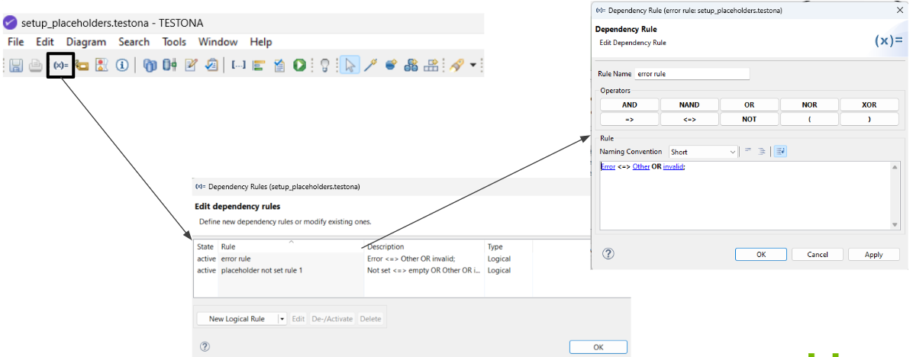

### **Step 5 : Generate test cases**
In this step, Testona Tool will use the rules defined in the previous step to generate the test cases. The tool will consider all possible combinations of input parameters and expected results to produce a comprehensive set of test cases. The tool will take into account all edge cases, such as invalid inputs and ensure that the system under test behaves as expected.

The generated test cases will be displayed in a matrix format, with each row representing a single test case. The table will contain the inputs, expected results, and a description of each test case. This will make it easy for the user/test engineer to understand the purpose of each test case and verify its validity.

By using Testona Tool, the time and effort needed to manually generate the test cases is significantly reduced. This results in a more comprehensive and accurate set of test cases that covers all possible scenarios and edge cases. Additionally, the tool provides metrics and evaluations to assess test scope and detect missing or redundant tests.

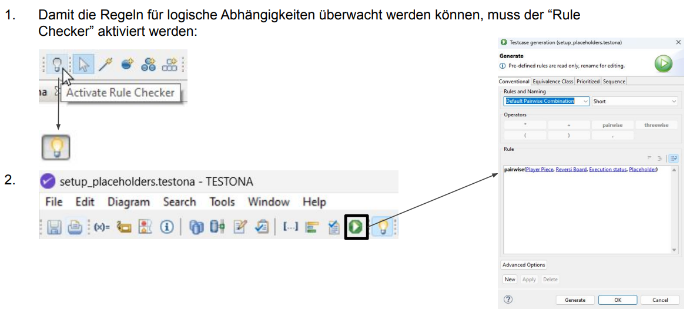
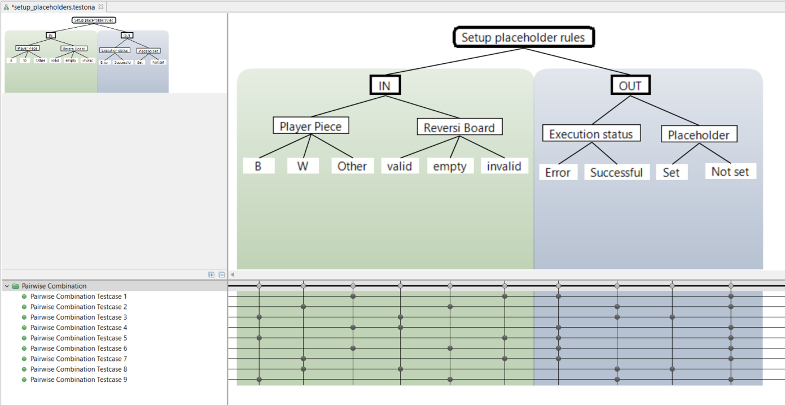

### **Step 6 : Generate code**

After defining the test cases and rules, the next step is to generate code using the Testona tool. This tool allows you to write code snippets for each classification and to consider necessary parameters such as `%CLASS%` (to add the name of the selected test item) or `%TEST%` (to add the name of the selected test item).

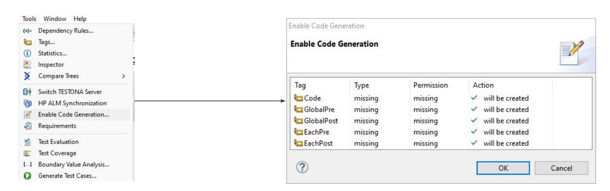
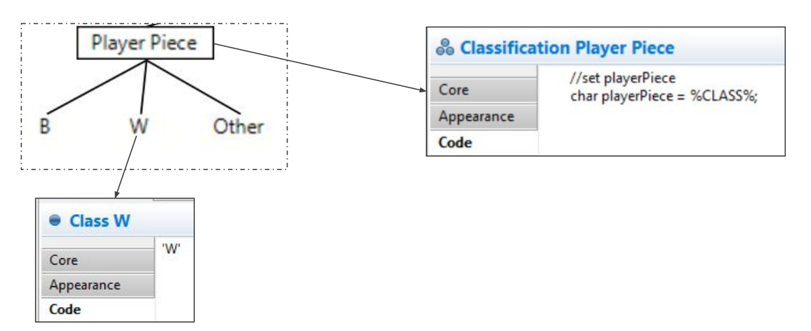
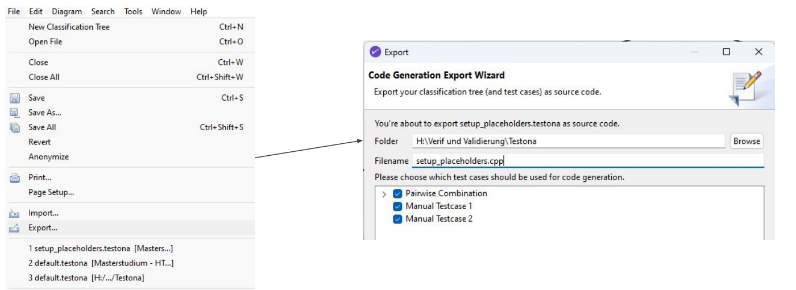

This is a snippet from the generated code:

    //Pairwise Combination Testcase 1
    {
       //set playerPiece
       char playerPiece = 'X';

       //set reversibaord
       ReversiBoard *reversiboard = NULL;

       //check whether the code exits due to invalid input
       bool execStatus = false;
       if (false == execStatus) {
            EXPECT_EXIT(placeholder_uut->setupPlaceholderRules(playerPiece, reversiboard), ::testing::ExitedWithCode(1),"");
       } else {
            placeholder_uut->setupPlaceholderRules(playerPiece, reversiboard);
       }
       
       //check whether a placeholder is set
       bool isPlaceholderSet = false;
       if (NULL != reversiboard){
            for(int i = 0; i < 8; i++){
                for(int j = 0; j < 8; j++){
                    if ('+' == reversiboard->getBoardCell(i,j)){
                        isPlaceholderSet = true;
                        placeholder_uut->resetPlaceholderPlaces(reversiboard); 
                        break;
                    }
                }
            }
       }

       EXPECT_EQ(isPlaceholderSet, false);
    
    }

The code generated will be based on the code snippets and parameters defined in the previous steps. The fully generated code can be found in the `tests/black_box_tests/placeholder_test` directory, where you can examine the code in detail.

# Conclusion
In conclusion, the Testona tool provides a systematic and efficient way of testing software systems. By following the six steps outlined above, a user can decompose their system into testable components, define inputs and expected outputs, create rules to generate test cases, and finally generate code to test the system. These steps not only make testing easier but also increase the quality of the tests by reducing the risk of human error and reducing the time spent writing test cases. The tool provides a clear and organized way to track and manage testing activities, making it easier for software engineers and QA teams to collaborate on testing efforts. The generated code can also be used as a starting point for manual test cases, giving the team more flexibility in their testing approach. Overall, the Testona tool is a valuable asset for any software development project looking to improve the quality and efficiency of their testing efforts.
