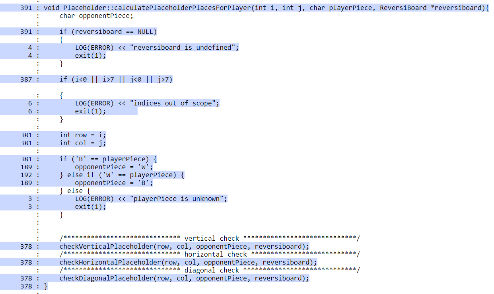
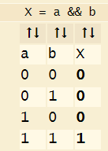
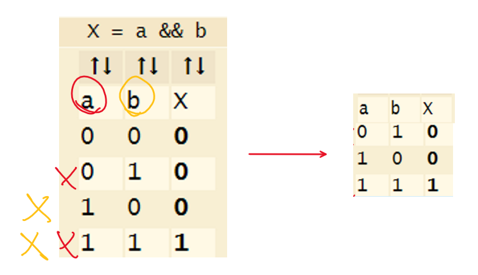
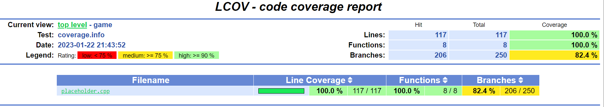

# White box test and coverage
White box testing, also known as structural testing or clear box testing, is a method of software testing that examines the internal structure of the code and the logic flow of the program. This type of testing is focused on verifying the correctness of the implementation, rather than just the output of the program.

Coverage, in the context of white box testing, refers to the extent to which the code has been executed during testing. This can include line coverage, branch coverage, and modified condition/decision coverage (MCDC).

## Overview

In this project, we have used `lcov` and `gcov` to measure the coverage of the code for middle complex functions of the source code. These tools generate reports that show which lines of code were executed during testing, allowing us to identify any areas of the code that may not have been fully tested.

## Testing

The following types of tests have been implemented for the `Placeholder` class:

* **Statement test**: These tests cover every single statement in the class to ensure that all lines of code are executed at least once.

* **Branch test**: These tests cover all branches in the class, ensuring that all possible paths in the code are executed at least once.

* **MCDC test**: These tests cover the important combinations of conditions in the class, ensuring that all possible outcomes of the conditions are tested.

## Statement testing
Taking as an example on how `Placeholder::checkVerticalPlaceholderStatement` was tested to cover all the lines:

    TEST_F(PlaceholderTest, CheckVerticalPlaceholderStatement) {
        reversiboard.cleanBoard();

        /************************* Test for valid input ********************************/
        //down
        int i = 3, j = 4;
        char opponentPiece = 'W';
        reversiboard.setBoardCell(2,4,opponentPiece);
        reversiboard.setBoardCell(i,j,'B');
        placeholder_uut->checkVerticalPlaceholder(i, j, opponentPiece, &reversiboard);
        EXPECT_EQ(reversiboard.getBoardCell(1,4),'+');
        reversiboard.cleanBoard();

        //upper
        i = 3;
        j = 4;
        opponentPiece = 'W';
        reversiboard.setBoardCell(4,4,opponentPiece);
        reversiboard.setBoardCell(i,j,'B');
        placeholder_uut->checkVerticalPlaceholder(i, j, opponentPiece, &reversiboard);
        EXPECT_EQ(reversiboard.getBoardCell(5,4),'+');
        reversiboard.cleanBoard();

        // Test for out of scope indices
        i = -1;
        j = 8;
        EXPECT_EXIT(placeholder_uut->checkVerticalPlaceholder(i, j, opponentPiece, &reversiboard),
                    ::testing::ExitedWithCode(1), "");

        // Test for undefined player
        opponentPiece = 'X';
        EXPECT_EXIT(placeholder_uut->checkVerticalPlaceholder(i, j, opponentPiece, &reversiboard),
                    ::testing::ExitedWithCode(1), "");

        // Test for undefined reversiboard
        ReversiBoard* reversiboard_null = NULL;
        EXPECT_EXIT(placeholder_uut->checkVerticalPlaceholder(i, j, opponentPiece, reversiboard_null),
                    ::testing::ExitedWithCode(1), "");
    }

This code uses Google Test framework to test the method `checkVerticalPlaceholderStatement` of the Placeholder class. The test cases cover different scenarios that the method might encounter, including:

* Test for valid input, where the method is called with valid values for the `i`, `j`, and `playerPiece` parameters.

* Test for unknown playerPiece, where the method is called with an invalid value for the `playerPiece` parameter.

* Test for out of scope indices, where the method is called with indices that are outside the valid range.

* Test for undefined reversiboard, where the method is called with a null pointer for the `reversiboard` parameter.

Each test case calls the method with specific input values and checks the output using the `EXPECT_EXIT` and `EXPECT_EQ` macros. By covering different scenarios and testing for different edge cases, the code ensures that all lines of the `checkVerticalPlaceholderStatement` method have been executed and that the method behaves as expected in different situations.

## Branch testing 
In addition to the existing test case for the `Placeholder` class, a branch test is also needed to ensure that all possible branches of the code are executed and that the function behaves correctly for all possible inputs and conditions.

To accomplish this, additional test cases are added to the existing statement test to cover all possible edges. The test case is named `CheckVerticalPlaceholderBranch` and is defined as a part of the `PlaceholderTest` fixture.

To implement this test, other conditions need to be added to the statement test to cover all the edges:

    TEST_F(PlaceholderTest, CheckVerticalPlaceholderBranch) {
        reversiboard.cleanBoard();

        //down
        //valid placeholder
        int i = 3, j = 4;
        char opponentPiece = 'W';
        reversiboard.setBoardCell(2,4,opponentPiece);
        reversiboard.setBoardCell(i,j,'B');
        placeholder_uut->checkVerticalPlaceholder(i, j, opponentPiece, &reversiboard);
        EXPECT_EQ(reversiboard.getBoardCell(1,4),'+');
        reversiboard.cleanBoard();

        //invalid placeholder
        i = 3, j = 4;
        opponentPiece = 'W';
        reversiboard.setBoardCell(2,4,opponentPiece);
        reversiboard.setBoardCell(i,j,'B');
        placeholder_uut->checkVerticalPlaceholder(0, j, opponentPiece, &reversiboard);
        EXPECT_EQ(reversiboard.getBoardCell(1,4),'-');
        reversiboard.cleanBoard();

        //upper
        //valid placeholder
        i = 3;
        j = 4;
        opponentPiece = 'W';
        reversiboard.setBoardCell(4,4,opponentPiece);
        reversiboard.setBoardCell(i,j,'B');
        placeholder_uut->checkVerticalPlaceholder(i, j, opponentPiece, &reversiboard);
        EXPECT_EQ(reversiboard.getBoardCell(5,4),'+');
        reversiboard.cleanBoard();

        //invalid placeholder
        i = 3;
        j = 4;
        opponentPiece = 'W';
        reversiboard.setBoardCell(4,4,opponentPiece);
        reversiboard.setBoardCell(i,j,'B');
        placeholder_uut->checkVerticalPlaceholder(0, j, opponentPiece, &reversiboard);
        EXPECT_EQ(reversiboard.getBoardCell(5,4),'-');
        reversiboard.cleanBoard();
        
        .
        .
        .
    }

As shown in the code, we added to each of the **upper** and **down** check another conditions to cover the false edges.

## MCDC testing
The `Placeholder::checkHorizontalPlaceholder` function is responsible for checking the horizontal placeholders on the board, and it includes a while loop with two conditions, `j-count>=0` (condition a) and `reversiboard->getBoardCell(i,j-count) == opponentPiece` (condition b), as shown below:

    while(j-count>=0 && reversiboard->getBoardCell(i,j-count) == opponentPiece) {
        count++;
    }

To ensure that all possible combinations of these conditions are tested, a truth table is created, as shown in the following image:

However, since some combinations may not affect the overall outcome of the function, it is important to optimize the truth table and identify the important combinations. In this case, the important combinations are:

For instance the important combinations are:
* `j-count>=0` false and `reversiboard->getBoardCell(i,j-count) == opponentPiece`is true

* `j-count>=0` true and `reversiboard->getBoardCell(i,j-count) == opponentPiece` is false

* `j-count>=0` true and `reversiboard->getBoardCell(i,j-count) == opponentPiece` is true

Using the truth table, we optimized it to 3 combinations instead of 4. But `j-count>=0` and `reversiboard->getBoardCell(i,j-count) == opponentPiece` are related to each other.
Means that if `j-count>=0` is false then `reversiboard->getBoardCell(i,j-count) == opponentPiece` will be definitely false since the index of the table is negative. Which leaves us to 2 important combinations:

* `j-count>=0` true and `reversiboard->getBoardCell(i,j-count) == opponentPiece` is false

* `j-count>=0` true and `reversiboard->getBoardCell(i,j-count) == opponentPiece` is true

To fully cover all the important combinations of this while condition, we need test these 2 combinations.

**TRUE TRUE** combination:

    i = 2, j = 3;
    opponentPiece = 'W';
    reversiboard.setBoardCell(2,4,opponentPiece);
    reversiboard.setBoardCell(i,j,'B');
    placeholder_uut->checkHorizontalPlaceholder(i, j, opponentPiece, &reversiboard);
    EXPECT_EQ(reversiboard.getBoardCell(2,5),'+');

**TRUE FALSE** combination:

    i = 2, j = 3;
    opponentPiece = 'W';
    reversiboard.setBoardCell(2,4,'B');
    reversiboard.setBoardCell(i,j,'B');
    placeholder_uut->checkHorizontalPlaceholder(i, j, opponentPiece, &reversiboard);
    EXPECT_EQ(reversiboard.getBoardCell(2,5),'+');

## Usage
To run all the tests and generate a HTML coverage report, a shell script named `run_tests_with_coverage.sh` has been created to automate the process and save time. The script contains the following code:

    #!/bin/bash

    # Set the target file to be tested
    TARGET_FILE="/path/to/target/file.cpp"

    # Clean old data
    echo "Cleaning old data..."
    rm -rf coverage.info html
    make clean

    # Compile tests
    echo "Compiling tests..."
    make

    # Run tests
    echo "Running tests..."
    ./testrunner

    # Generate coverage report
    echo "Generating coverage reports..."
    lcov --capture --directory . --output-file coverage.info --rc lcov_branch_coverage=1
    lcov -e coverage.info -o coverage.info $TARGET_FILE --rc lcov_branch_coverage=1
    genhtml --branch-coverage --highlight -legend coverage.info --output-directory html --rc lcov_branch_coverage=1

    # Change directory and open report
    cd html
    if [[ "$(uname -r)" =~ "WSL" ]]; then 
        explorer.exe index.html
    else
        open index.html 
    fi

It's important to note that the target file path `TARGET_FILE` needs to be modified according to the specific file or files that need to be tested. 

After running the script, the HTML report will be generated in the html folder and opened in the default web browser. The report includes the coverage, highlighting the lines of code that have been executed and those that have not.

An example of a generated html report is shown under `html_report/` folder.

## Notes

It's important to mention that the branch coverage reported by lcov is actually MCDC coverage. This is because the tool is not specifically designed to measure branch coverage, but rather, it measures the coverage of all possible combinations of conditions in a program. Therefore, it's more accurate to refer to it as MCDC coverage rather than branch coverage.

Reaching 100% coverage for MCDC in lcov is impossible in some cases for complex functions due to the variety of reasons (e.g example mentioned before). That is why the branch coverage percent of placeholder.cpp is at around 80%.

The tests can be found at this link below:

https://gitlab.rz.htw-berlin.de/m14_vv/2022ws_team2a/-/tree/main/ReversiGame/tests/white_box_test_and_coverage

## Conclusion
Through the white box testing of the `Placeholder` class, we were able to identify and fix some if statements that were not necessary. By examining the code structure and control flow, we were able to optimize the function and remove any redundant or unnecessary conditions. This helped to improve the overall performance and efficiency of the class. Additionally, it also helped us to identify any potential bugs or errors that have been introduced during development. White box testing is an important tool for ensuring code quality and maintaining a high level of maintainability in the long term.