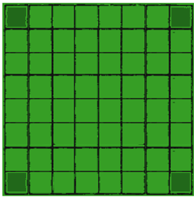
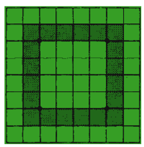
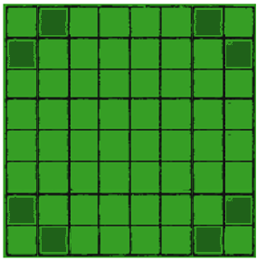

# AI Strategy

## Priority 1 : Corners

Corners are undoubtedly a strong position and can higher up the chances to win the game. Discs played in the corners can't be flipped. The AI should then place disk in the corners if they are valid moves.

The darker dots on the board indicate the corners.

   

## Priority 2 : Danger zone

The rows shown in the image below, could be considered a "danger zone", since a disc in these rows could be your opponent's bridge to a corner or an outside position. The AI should then avoid placing discs in the danger zone if there are other valid moves.

**Trigger** when : No valid corners are available.

The darker dots on the board indicate "the danger zone".

   

## Priority 3 : Isolated C-Squares Can be a trouble

C-squares (B1, G1, A2, H2, A7, H7, B8 and G8) are located on the edges and are next to corners. Placing a disc there can cause troubles and can be attacked by the player. The AI should then avoid placing discs in the C-squares zone if there are other valid moves.

**Trigger** when :

- No valid corners are available.
- Disc can be placed outside the danger zone.

The darker dots on the board indicate the C-squares.

   

  
## Priority 4 : Randomize

The AI should place a disc in a random square if all other priorities are not valid.

**Trigger** when :

- No valid corners are available.
- Disc can be placed outside the danger zone.
- Disc can be placed outside the C-square.
