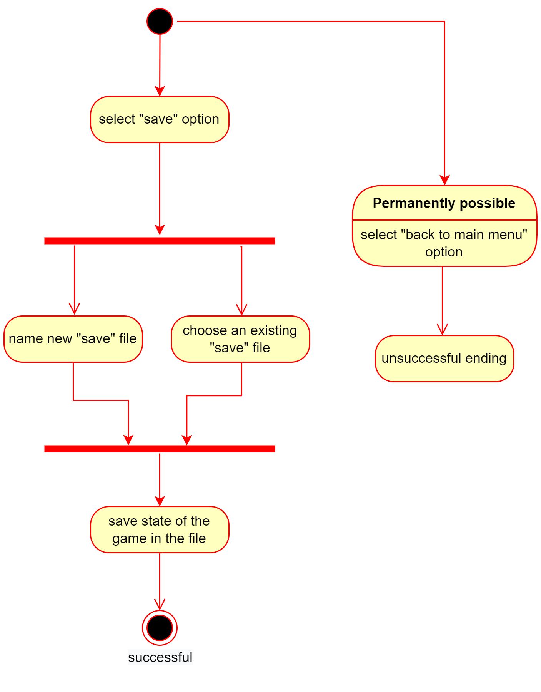
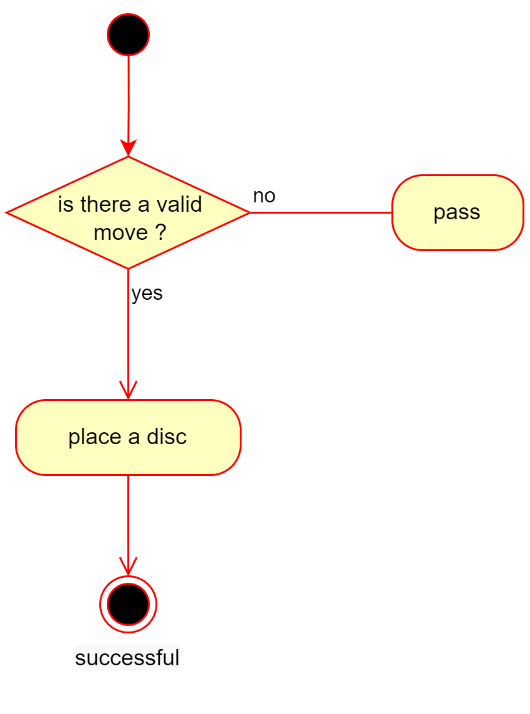

# Use Case Diagram 

# Use Cases 

## UC-01: Start game

| **Actors**                            |        |
| --------------------------------------| ------ |
| Primary actors                        |User      |
| Secondary actors                      |System    |
| **Preconditions**                     |Game option is selected.     |
| **Scenario sketch**                   |     |
|  Standard flow                        |Step 1:The player starts the game.  |
|                                       |Step 2:The player selects the black disc. |
|                                       |Step 3:The system runs the game.|
| Alternative /exceptional flow 1       |Step 1:The player starts the game. |
|                                       |Step 2:The player selects white disc. |
|                                       |Step 3:The system runs the game.|
| **Postconditions**                    |The game is running.      |

## UC-02: Restart 

| **Actors**                       |        |
| -------------------------------- | ------ |
| Primary actors                   | User         |
| Secondary actors                 | System       |
| **Preconditions**                | The game is running.   |
| **Scenario sketch**              |        |
| Standard flow                    | Step 1: The user selects the return option. |
|                                  | Step 2: The system shows the list of options. |
|                                  | Step 3: The user chooses the "restart" option. |
|                                  | Step 4: The system asks for a confirmation.  |
|                                  | Step 5: The user confirms the action.  |
|                                  | Step 6: The system returns to a new game session.  |
|                                  | Step 7: The Use Case ends successful.  |
| Alternative / exceptional flow 1 | Step 1: The user selects the return option. |
|                                  | Step 2: The system shows the list of options.   |
|                                  | Step 3: The user chooses the option "Cancel".   |
|                                  | Step 4: The Use Case ends unsuccessful.    |
| Alternative / exceptional flow 2 | Step 1: The user selects the return option. |
|                                  | Step 2: The system shows the list of options.   |
|                                  | Step 3: The user chooses the "restart" option.   |
|                                  | Step 4: The system asks for a confirmation.    |
|                                  | Step 5: The user rejects the action.  |
|                                  | Step 6: The Use Case ends unsuccessful.    |
| **Postconditions**               | The board has been reset to a new game.    |

## UC-03: Pause the game 

| **Actors**                       |        |
| -------------------------------- | ------ |
| Primary actors                   |User      |
| Secondary actors                 |System |
| **Preconditions**                |The game is running.     |
| **Scenario sketch**              |         |
| Standard flow                    |Step 1:The user chooses return. |
|                                  |Step 2:The system saves the current state of the game. |
|                                  |Step 3:The system shows a list of options.|
| Alternative / exceptional flow 1 |Step 1:The system shows a list of options.|
|                                  |Step 2:The user chooses the option "Cancel".|
|                                  |Step 3:The system returns to the recent state of the game.|
| Alternative / exceptional flow 2 |Step 1:The system shows a list of options.|
|                                  |Step 2:The user chooses the option "Exit".  |
|                                  |Step 3:The system ends and switch off the game. |
| **Postconditions**               |The game can be resumed or ended. |

## UC-04: Save game

| **Actors**                       |        |
| -------------------------------- | ------ |
| Primary actors                   | User       |
| Secondary actors                 | System       |
| **Preconditions**                |  The game is running.   |
| **Scenario sketch**              |        |
| Standard flow                    | Step 1: The user selects "save" option. |
|                                  | Step 2: The user names new "save" file. |
|                                  | Step 3: The system saves the state of the game in the new file. |
| Alternative / exceptional flow   | Step 2: The user chooses an existing "save" file.   |
|                                  | Step 3: The system overwrites and saves the new state of the game in the existing file. |
| **Postconditions**               | Game state saved successfully.        |

## UC-05: Load a saved game

| **Actors**                       |        |
| -------------------------------- | ------ |
| Primary actors                   | User       |
| Secondary actors                 | System       |
| **Preconditions**                |  The program is running in the main menu.   |
| **Scenario sketch**              |        |
| Standard flow                    | Step 1: The user picks the "load" option. |
|                                  | Step 2: The system lists the saved game states. |
|                                  | Step 3: The user picks one save file. |
|                                  | Step 4: The system loads the game state.  |
|                                  | Step 5: The Use Case ends successful.  |
| Alternative / exceptional flow 1 | Step 1: The user picks the "load" option. |
|                                  | Step 2: The system shows a empty list.   |
|                                  | Step 3: The Use Case ends unsuccessful.    |
| Alternative / exceptional flow 2 | Step 1: The user picks the "load" option.   |
|                                  | Step 2: The system lists the saved game states.   |
|                                  | Step 3: The user goes back to the main menu to start a new game instead.    |
|                                  | Step 4: The Use Case ends unsuccessful.    |
| **Postconditions**               | A previous game session can be resumed.        |

## UC-06: Exit game

| **Actors**                       |        |
| -------------------------------- | ------ |
| Primary actors                   | User |
| Secondary actors                 | System |
| **Preconditions**                | The game is running.   |
| **Scenario sketch**              | Exit game                        |
| Standard flow                    | Step 1: The user clicks on the exit button. |
|                                  | Step 2: The system ask the user to save the game.|
|                                  | Step 3: The user confirms. |
|                                  | Step 4: The system saved the current state of the game. |
|                                  | Step 5: The system turns off the game. |
| Alternative / exceptional flow   | Step 1: The user clicks on the exit button. |
|                                  | Step 2: The system ask the user to save the game.|
|                                  | Step 3: The user rejects. |
|                                  | Step 4: The system turns off the game. |
| **Postconditions**               | Game exited successfully. |

## UC-07: Place a disc game

| **Actors**                       |        |
| -------------------------------- | ------ |
| Primary actors                   | User  |
| Secondary actors                 | System |
| **Preconditions**                | The game is running. |
|                                  | UC-08 Update state of the game.|
| **Scenario sketch**              |       |
| Standard flow                    | Step 1: User places a disc.  |
|                                  | Step 2: System validates the move.|
| Alternative / exceptional flow 1 | Step 1: User places a disc.  |
|                                  | Step 2: System rejects the move.|
|                                  | Step 3: System warns player. |
|                                  | Step 4: User repeats the move.|
| **Postconditions**               | Disc is placed successfully. |

## UC-08: Update state of the game

| **Actors**                       |        |
| -------------------------------- | ------ |
| Primary actors                   | System |
| Secondary actors                 | Player       |
| **Preconditions**                | 1. The game is running. |
|                                  | 2. UC-09 Update the board |
| **Scenario sketch**              | Update state of the game.       |
| Standard flow                    | Step 1: System checks valid Moves for the next turn.|
|                                  | Step 2: System validates the available moves.|
|                                  | Step 3: Next player continues the game.|
| Alternative / exceptional flow 1 | Step 1: System checks valid Moves for the next turn.|
|                                  | Step 2: System finds no possible moves.|
|                                  | Step 3: System checks available moves for the other player. |
|                                  | Step 4: System finds possible moves. |
|                                  | Step 5: Next player gets skipped.  |
| Alternative / exceptional flow 2 | Step 1: System checks valid Moves for the next turn.|
|                                  | Step 2: System finds no possible moves.|
|                                  | Step 3: System checks available moves for the other player. |
|                                  | Step 4: System finds no more possible moves for both players. |
|                                  | Step 5: The game is ended. |
| **Postconditions**               | The turn of the next player is valid.       |

## UC-09: Update the board 

| **Actors**                       |        |
| -------------------------------- | ------ |
| Primary actors                   | System |
| Secondary actors                 |        |
| **Preconditions**                | The game is running.    |
|                                  | Disc has been placed. |
| **Scenario sketch**              | Update the board.  |
| Standard flow                    | Step 1: System checks the placement of the Player's disc|
|                                  | Step 2: System flips the discs according to the rules.|
|                                  | Step 3: System prints the new board. |
| **Postconditions**               | The Board updated successfully.        |

## UC-10: Show result 

| **Actors**                       |        |
| -------------------------------- | ------ |
| Primary actors                   |System     |
| Secondary actors                 |    -    |
| **Preconditions**                |The game is ended.   |
| **Scenario sketch**              | - |
|  Standard flow                  |Step 1:The game score is displayed   |
| **Postconditions**               |A list can be displayed with top scores     |

